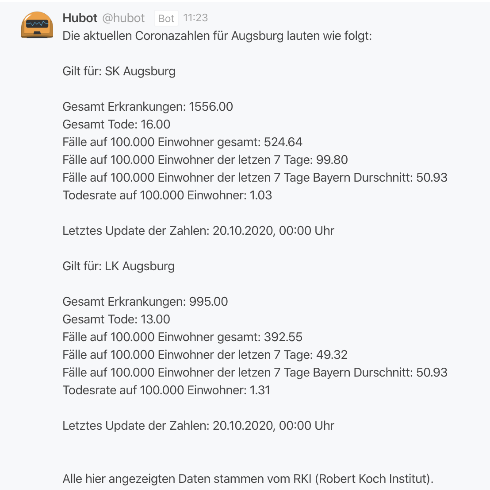

<table align="center"><tr><td align="center" width="9999">

# Hubot Corona Stats Script

A simple hubot script to show the crona statistics for a given city in germany.
Overall i have to say:

</td></tr></table>
<table align="left"><tr><td align="left" width="9999">

## Info

This script isnt aint much but i would like to share it here. Feel free to take it and refactor it.
Currently the output looks like the following
</td></tr></table>
<table align="center"><tr><td align="center" width="9999">

</td></tr></table>
<table align="left"><tr><td align="left" width="9999">

## Installation

In order to install this script just copy it over in your `script` folder in the location of your hubot. To get Data displayed for your location you have to find the part `where=GEN%3D%27Augsburg%27` and replace `Augsburg` with the city of your choice. But as far as i know the API does only handle german citys and places.
</td></tr></table>
<table align="left"><tr><td align="left" width="9999">
